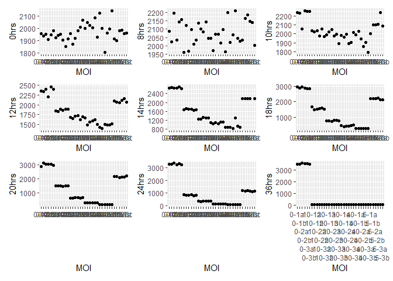
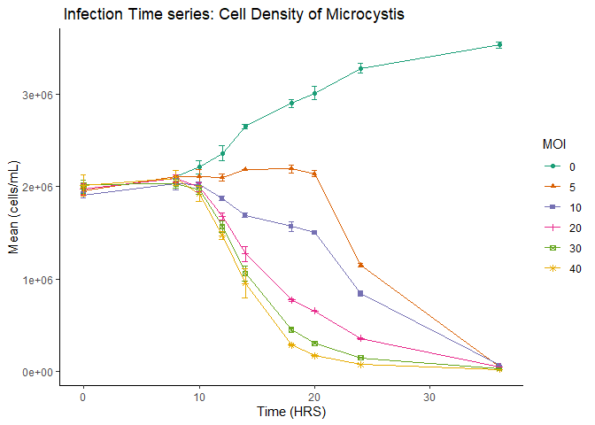
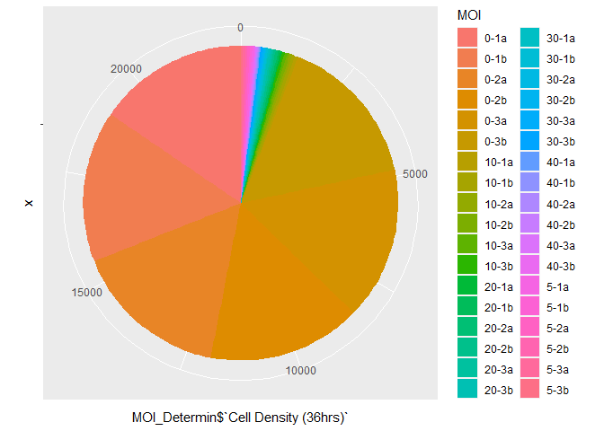

# hmk07_badplot

## The Data

MOI (Multiplicity of infection) data of Microcystis aeuroginasa infected
with LM-MMA01 virus.

## Bad Plot: Reasons

- Uses too much ink
- Misleading for how the data in all the plots is related to each other
- Unclear axis labels
- No statistics shown for the data

``` r
#Packages
library(tidyverse)
library(ggplot2)
library(dplyr) 
#getwd()

#Actual version
#Load CSV
MOI_Determin<-read_csv("20231020HMK7MOI.csv")

#trying to get 2 digits for MOI in the figure legend
format(MOI_Determin$MOI,digits=2, nsmall=2)
```

     [1] "0-1a " "0-1b " "0-2a " "0-2b " "0-3a " "0-3b " "5-1a " "5-1b " "5-2a "
    [10] "5-2b " "5-3a " "5-3b " "10-1a" "10-1b" "10-2a" "10-2b" "10-3a" "10-3b"
    [19] "20-1a" "20-1b" "20-2a" "20-2b" "20-3a" "20-3b" "30-1a" "30-1b" "30-2a"
    [28] "30-2b" "30-3a" "30-3b" "40-1a" "40-1b" "40-2a" "40-2b" "40-3a" "40-3b"

``` r
#Figure generation: want different colors and different symbols in the legend per MOI with 2 decimal places
zero<-ggplot(MOI_Determin, aes(x=MOI, y=MOI_Determin$`Cell Density (0hrs)`, 
                         ))+geom_point()+labs(y="0hrs")
eight<-ggplot(MOI_Determin, aes(x=MOI, y=MOI_Determin$`Cell Density (8hrs)`, 
                         ))+geom_point()+labs(y="8hrs")
ten<-ggplot(MOI_Determin, aes(x=MOI, y=MOI_Determin$`Cell Density (10hrs)`, 
                         ))+geom_point()+labs(y="10hrs")
twelve<-ggplot(MOI_Determin, aes(x=MOI, y=MOI_Determin$`Cell Density (12hrs)`, 
                         ))+geom_point()+labs(y="12hrs")
fourteen<-ggplot(MOI_Determin, aes(x=MOI, y=MOI_Determin$`Cell Density (14hrs)`, 
                         ))+geom_point()+labs(y="14hrs")
eighteen<-ggplot(MOI_Determin, aes(x=MOI, y=MOI_Determin$`Cell Density (18hrs)`, 
                         ))+geom_point()+labs(y="18hrs")
twenty<-ggplot(MOI_Determin, aes(x=MOI, y=MOI_Determin$`Cell Density (20hrs)`, 
                         ))+geom_point()+labs(y="20hrs")
twentyfour<-ggplot(MOI_Determin, aes(x=MOI, y=MOI_Determin$`Cell Density (24hrs)`, 
                         ))+geom_point()+labs(y="24hrs")
thirtysiz<-ggplot(MOI_Determin, aes(x=MOI, y=MOI_Determin$`Cell Density (36hrs)`, 
                         ))+geom_point()+labs(y="36hrs")
  
library(patchwork)
my_plot<-zero+eight+ten+twelve+fourteen+eighteen+twenty+twentyfour+thirtysiz+plot_layout( ncol=3)+scale_x_discrete(guide = guide_axis(n.dodge=6))

my_plot
```

    Warning: Removed 1 rows containing missing values (`geom_point()`).



``` r
#ggsave("badplot.png", my_plot, width = 15, height = 10)

thirtysix<-ggplot(MOI_Determin, aes(x="", y=MOI_Determin$`Cell Density (36hrs)`, fill=MOI))+geom_bar(stat="identity", width=1 )+ coord_polar("y",start=0)
```

\##Good Plot: - Saves ink - Colorblind friendly - Shows statistics for
the data - Understandable for how the data is related to each other

``` r
#Packages
library(tidyverse)
library(ggplot2)
library(dplyr) 
getwd()
```

    [1] "C:/Users/meagh/OneDrive - University of Tennessee/Grad Courses/Micro 575"

``` r
#Actual version
#Load CSV
df<- read_csv("2023092325_MA_MOI_Determination.csv")
glimpse(df)
```

    Rows: 54
    Columns: 4
    $ Time               <dbl> 0, 8, 10, 12, 14, 18, 20, 24, 36, 0, 8, 10, 12, 14,…
    $ VLPMOI             <dbl> 0, 0, 0, 0, 0, 0, 0, 0, 0, 5, 5, 5, 5, 5, 5, 5, 5, …
    $ Mean               <dbl> 1950000, 2110000, 2210000, 2360000, 2650000, 290000…
    $ `Cell Density STD` <dbl> 20600, 64000, 71800, 78600, 26400, 42900, 70700, 51…

``` r
#trying to get 2 digits for MOI in the figure legend
format(df$VLPMOI,digits=2, nsmall=2)
```

     [1] " 0.00" " 0.00" " 0.00" " 0.00" " 0.00" " 0.00" " 0.00" " 0.00" " 0.00"
    [10] " 5.00" " 5.00" " 5.00" " 5.00" " 5.00" " 5.00" " 5.00" " 5.00" " 5.00"
    [19] "10.00" "10.00" "10.00" "10.00" "10.00" "10.00" "10.00" "10.00" "10.00"
    [28] "20.00" "20.00" "20.00" "20.00" "20.00" "20.00" "20.00" "20.00" "20.00"
    [37] "30.00" "30.00" "30.00" "30.00" "30.00" "30.00" "30.00" "30.00" "30.00"
    [46] "40.00" "40.00" "40.00" "40.00" "40.00" "40.00" "40.00" "40.00" "40.00"

``` r
#Figure generation: want different colors and different symbols in the legend per MOI with 2 decimal places
my_good<- ggplot(df, aes(x=Time, y= Mean, color = factor(VLPMOI), shape=factor(VLPMOI))) + 
  geom_line() +
  geom_point() +
  scale_color_brewer(palette="Dark2") +
  geom_errorbar(ymin=(df$Mean - df$`Cell Density STD`), ymax=(df$Mean+ df$`Cell Density STD`), width = 0.5)+
  labs(x="Time (HRS)", y="Mean (cells/mL)",color="MOI", shape = "MOI", title=" Infection Time series: Cell Density of Microcystis") +
  theme_classic()

my_good
```



\##For the fun of it: Another bad plot - Forcably made a pie chart with
ggplot

``` r
thirtysix<-ggplot(MOI_Determin, aes(x="", y=MOI_Determin$`Cell Density (36hrs)`, fill=MOI))+geom_bar(stat="identity", width=1 )+ coord_polar("y",start=0)

thirtysix
```


