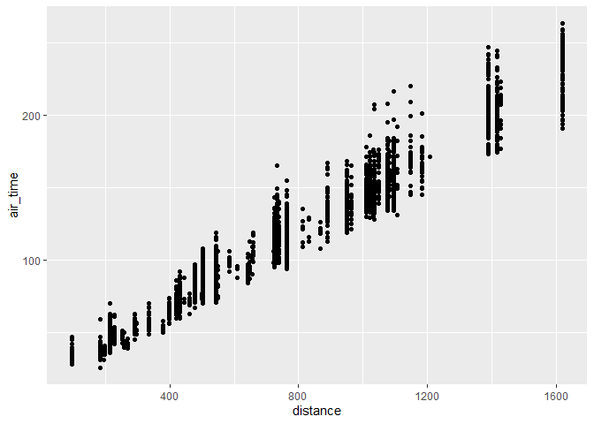
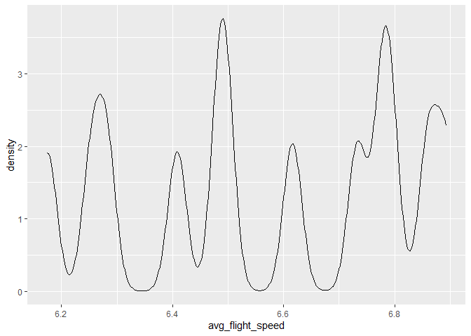

# Hmk_04 template: Data frames and data wrangling

Please read the entire [R for Data
Science](https://r4ds.hadley.nz/data-transform) before you do this
homework.

This homework relies on the `nycflights13` package, which contains
several data frames, including `airlines`, `airports`, `flights`,
`planes`, and `weather`. Loading `nycflights13`
(`library(nycflights13)`) puts all of these data frames on the search
path.

## Installing data packages

Remember that any package needs to be installed only once (per version
of R), but needs to be loaded every time we start a new R session.

To install `nycflights13`, use `install.packages("nycflights13")` (with
quotation marks). To load it, use `library(nycflights13)`.

``` r
library(nycflights13)
library(tidyverse)
```

    ── Attaching core tidyverse packages ──────────────────────── tidyverse 2.0.0 ──
    ✔ dplyr     1.1.2     ✔ readr     2.1.4
    ✔ forcats   1.0.0     ✔ stringr   1.5.0
    ✔ ggplot2   3.4.3     ✔ tibble    3.2.1
    ✔ lubridate 1.9.2     ✔ tidyr     1.3.0
    ✔ purrr     1.0.2     
    ── Conflicts ────────────────────────────────────────── tidyverse_conflicts() ──
    ✖ dplyr::filter() masks stats::filter()
    ✖ dplyr::lag()    masks stats::lag()
    ℹ Use the conflicted package (<http://conflicted.r-lib.org/>) to force all conflicts to become errors

# Question 1: filtering

Make a plot of air time as a function of distance (air time on the y
axis, distance on the x axis) for all flights that meet the following
criteria:

- originate from LaGuardia airport (“LGA”)
- departed on the 16th of the month
- have a flight distance of less than 2000

``` r
result<- flights |>
  filter(origin=="LGA")|>
  filter(day==16) |>
  filter(distance<2000)

plt<-ggplot(data=result, mapping = aes(distance, air_time))+geom_point()

suppressWarnings(print(plt))
```



# Question 2: dealing with NAs

Make a data frame of all of the rows of `flights` that have values for
*both* `arr_time` and `dep_time` - that is, neither of those values are
`NA`.

``` r
resultQ2 <- flights |>
  filter(!is.na(arr_time)) |>
  filter(!is.na(dep_time))
```

Question/For me to think more about: How do I ask R to look for any NA
in the final df to confirm it worked? I used
print(is.na(resultQ2$arr_time)) and print(is.na(flights$arr_time)) for a
TRUE/FALSE.

## filtering NAs

`ggplot()` will automatically remove NA values from the plot, as you may
have seen in question 1, but it emits a warning message about that. Of
course you could silence the warning message using [chunk
options](https://bookdown.org/yihui/rmarkdown-cookbook/chunk-options.html),
but how could you prevent them from appearing in the first place?

ANS: I can prevent the warning message by assigning the plot to a
variable and using the suppressWarning( ) function when I display the
plot.

``` r
plt2<-ggplot(data=result, mapping = aes(distance, air_time))+geom_point()

suppressWarnings(print(plt2))
```


# Question 3: adding columns

Create a data frame of average flight speeds, based on `air_time` and
`distance`. Make either a histogram or a density plot of the data. If
you like, you may break the data out (e.g. by airline, or some other
variable) in a way that you think makes sense.

``` r
resultQ3 <- flights |>
  mutate(speed = distance / air_time) |>
  group_by(month) |>
  mutate(avg_flight_speed = mean(speed, na.rm=TRUE))

plt3 <- ggplot(data=resultQ3, mapping =aes(avg_flight_speed)) + geom_density()
print(plt3)
```


